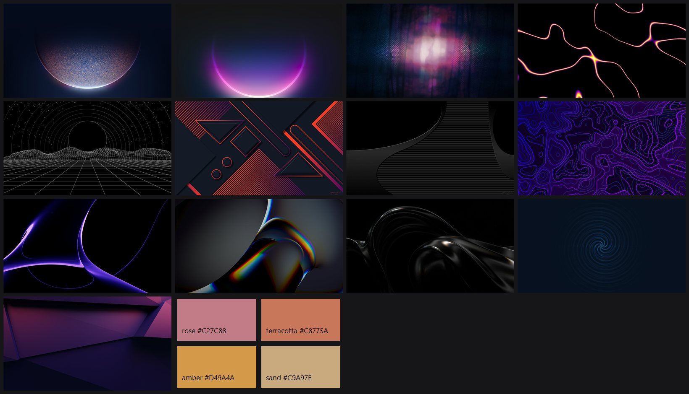

# Minimal Dark for Windows 11

A clean, minimal dark setup for Windows 11 with a warm accent colour and a rotating
abstract wallpaper set on both the desktop and the lock screen. It only uses
built-in Windows settings, with no third-party customisation tools, and
`uninstall.ps1` puts back exactly what was there before.



## What it does

- **Look:** dark mode for apps and the system, transparency off, and one warm
  accent colour used only for highlights. The taskbar, Start and title bars are not tinted.
- **Wallpaper:** 13 dark abstract wallpapers (4K or larger), shuffled every 30 minutes.
- **Lock screen:** the same wallpapers, with a new one each time you sign in or unlock.
- **Taskbar:** centred icons, with Task View, Widgets, Search and Copilot hidden.
- **Start:** no Recommended section, recent apps, most-used apps or tips.
- **File Explorer:** opens to This PC, compact view, file extensions shown,
  Gallery and Home recent/frequent items hidden.
- **Ads and tips:** lock-screen fun facts, Settings suggestions, "finish setting up"
  prompts and suggested apps are turned off.
- **Windows Terminal:** a matching "Minimal Dark" colour scheme (charcoal background,
  accent-coloured cursor and selection) and a flat dark tab bar.
- Your sounds, cursors, animations and screensaver are left alone.

## Install

Open **PowerShell** (Start → type `powershell` → Enter), paste this and press Enter:

```powershell
irm https://raw.githubusercontent.com/lohanidamodar/wintheme/master/get.ps1 | iex
```

The installer:

1. Shows a menu to pick the accent colour.
2. Downloads everything to `%LOCALAPPDATA%\MinimalDark`.
3. Backs up your current settings.
4. Applies the theme.

The Settings app opens and closes on its own while the theme applies. You don't
need git, admin rights or any changes to your execution policy.

### Options

To skip the menu or add the admin extras, use this form and add the options at the end:

```powershell
& ([scriptblock]::Create((irm https://raw.githubusercontent.com/lohanidamodar/wintheme/master/get.ps1))) -Accent amber -Admin
```

| Option | What it does |
|---|---|
| `-Accent <name>` | `rose`, `terracotta`, `amber`, `sand`, or any hex colour such as `"#7FA3C2"` |
| `-Admin` | One UAC prompt. Turns Copilot off by policy and removes web/Bing results from Start search |

To change the accent later, or to update to the latest version, run the same
command again. Your original settings stay backed up from the first run.

Windows' anti-tamper protection blocks the Widgets policy even for administrators,
so Widgets is only hidden from the taskbar.

## Uninstall

```powershell
& ([scriptblock]::Create((irm https://raw.githubusercontent.com/lohanidamodar/wintheme/master/get.ps1))) -Uninstall
```

Add `-RemoveWallpapers` to also delete the downloaded images. Uninstall restores:

- every registry value, from the backup
- your previous theme and lock screen image
- your previous Windows Terminal colour scheme and theme
- the admin extras, if you applied them (one UAC prompt)

It also removes the lock screen scheduled task.

### From a clone instead

```powershell
git clone https://github.com/lohanidamodar/wintheme.git
cd wintheme
powershell -ExecutionPolicy Bypass -File .\install.ps1 -Accent rose
powershell -ExecutionPolicy Bypass -File .\uninstall.ps1
```

Only one copy can be installed at a time. If you try to install a second copy,
it stops and tells you where the first one is.
## Files

| File | Purpose |
|---|---|
| `get.ps1` | One-line installer: downloads the latest version and runs install or uninstall |
| `install.ps1` | Applies everything; safe to re-run |
| `uninstall.ps1` | Restores from the backups |
| `settings.ps1` | The single list of settings and accent colours, shared by all scripts |
| `admin.ps1` | Admin-only extras; run by `-Admin`, or directly |
| `lockscreen.ps1` | Picks a random lock screen image; run by a scheduled task at sign-in and unlock |
| `wallpapers.json` | Wallpaper download links; edit it to change the set |

These are created locally and git-ignored: `wallpapers/`, `backup.json`,
`backup-theme.theme`, `backup-admin.json`, `MinimalDark.theme` and `admin.log`.

## Customising

- **Wallpapers:** add or remove entries in `wallpapers.json`, or drop your own
  `.jpg`/`.png` files into `wallpapers/`, then re-run the install command. The installed copy lives in `%LOCALAPPDATA%\MinimalDark`.
- **Accent colours:** edit the `$Accents` table at the top of `settings.ps1`.
- **Slideshow interval:** change `Interval` (milliseconds) in the `Slideshow`
  section of `install.ps1`.

## Wallpaper credits

The wallpapers are downloaded from [Wallhaven](https://wallhaven.cc) at install
time. Only the small thumbnails in the preview image are stored in this repo.
All rights belong to their creators:

[polllj](https://wallhaven.cc/w/polllj) ·
[xe7jjd](https://wallhaven.cc/w/xe7jjd) ·
[vpep35](https://wallhaven.cc/w/vpep35) ·
[jedzym](https://wallhaven.cc/w/jedzym) ·
[ml3jm8](https://wallhaven.cc/w/ml3jm8) ·
[gwd837](https://wallhaven.cc/w/gwd837) ·
[po78p3](https://wallhaven.cc/w/po78p3) ·
[mlg7qm](https://wallhaven.cc/w/mlg7qm) ·
[7j9wle](https://wallhaven.cc/w/7j9wle) ·
[gw2r2e](https://wallhaven.cc/w/gw2r2e) ·
[yqvzek](https://wallhaven.cc/w/yqvzek) ·
[1q22pg](https://wallhaven.cc/w/1q22pg) ·
[8g5qgy](https://wallhaven.cc/w/8g5qgy)

## Requirements

Windows 11 (tested on 25H2, build 26200) and Windows PowerShell 5.1, which is built in.
Everything except the admin extras runs as your normal user.
